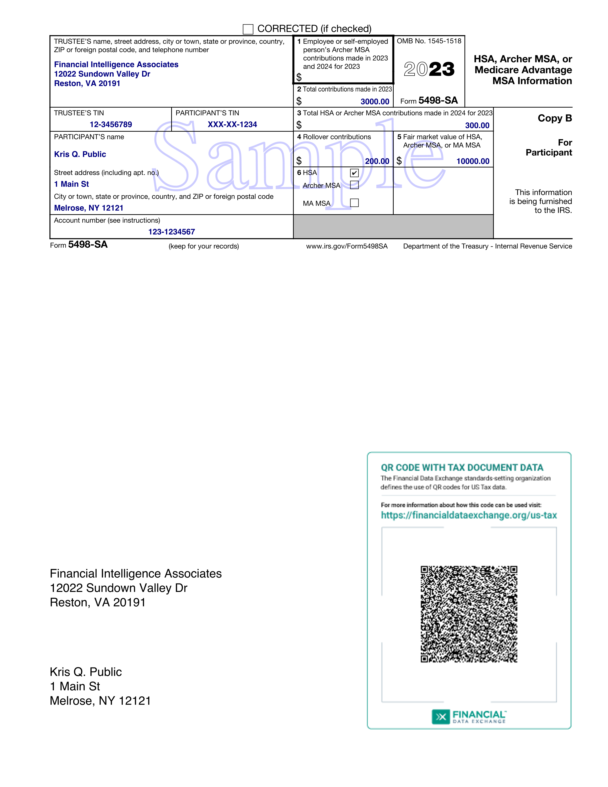

# tax-doc-sdk-tax5498sa

Software development kit to generate IRS Form 5498-SA as PDF file using Financial Data Exchange (FDX) standards including QR codes and embedded JSON.



This GitHub project is public but the Maven repositories on which it relies are private.


### Maven Artifacts - Google Artifact Registry Access

Access to the Maven artifacts in Google Artifact Registry require the following, one-time, set up.

Upon ordering the SDK, you indicate the email of the developer or the email of the Google service account that will be using the artifact. We grant the permission necessary to access the repository to that account.


### Obtain Credentials --> JSON File --> Environment Variable
 
Obtain a json file with the credentials corresponding to the developer or service account email (see below)
 
Create a GOOGLE_APPLICATION_CREDENTIALS environment variable that points to the file. For example:

```
export GOOGLE_APPLICATION_CREDENTIALS='/Users/johnjones/.config/gcloud/application_default_credentials.json'
```

### Getting Credentials for Your Google Account (for Your Email Address)

At a terminal prompt, type

```
gcloud auth application-default login
```

The gcloud program will prompt you to authorize creation of a credentials file. 

It will then save the file and display the path to the file.


### GCloud CLI 

The above assumes you have installed the Google Cloud Command Line Interface (CLI) on your system.

See the installation instructions at:

https://cloud.google.com/sdk/docs/install


